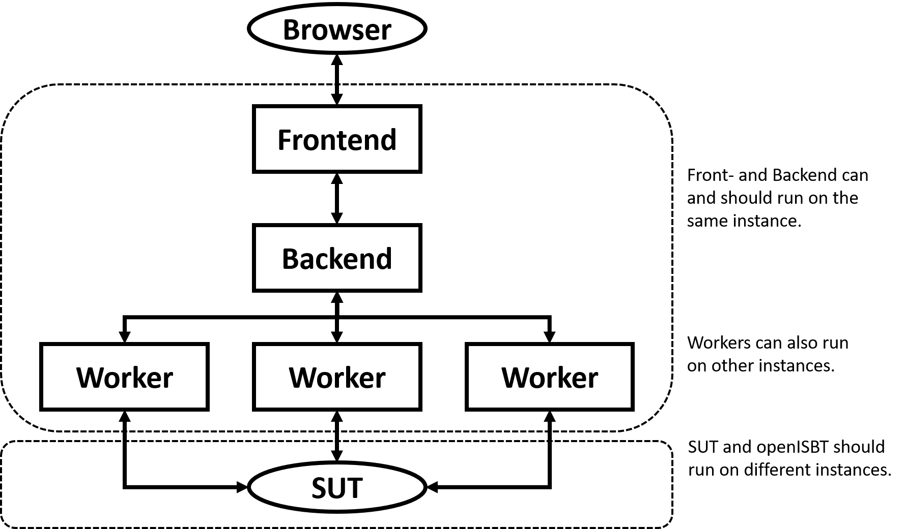

# openISBT
A Benchmark tool to test your REST service based on its openAPI3.0 interface description.

## Overview
System setup, at least two instances (one for the SUT and another for openISBT). 
If your benchmark client (the openISBT instance) becomes a bottleneck, 
you're benchmarking the client and should start at least one more instance with some more workers.

## Setup

### SUT
1. Setup your REST service and note the url.
2. Find or generate the openAPI3.0 description file.

### Backend
0. Setup Backend (details in the backend folder).
1. Clone this repository: 
2. Go to openISBTBackend folder: cd
3. Build backend: gradle clean build
4. Start backend:

## Frontend
0. Setup Frontend (details in frontend folder).
1. Clone this repository ():
2. Go to openISBT frontend folder: cd 
3. Build and run frontend: gradle clean build run
Per default, the frontend tries to connect to the backend at localhost; you can change this by defining ...

## Worker
0. Setup Worker (details in worker folder).
1. Clone this repository: 
2. Go to openISBTWorker folder: cd
3. Build worker jar: 
4. Start worker and definde port:

## Benchmark 
(with interactive browser GUI)

### Paste OpenAPI 3.0 specification file

### Define Workload

### Adjust Matching

### Generate Workload

### Define Workers

### Run Benchmark

### Get Results

## Batch Benchmark
(via terminal)
-> Not yet implemented
