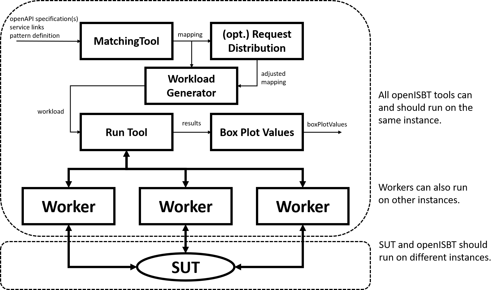

## Via Terminal (Batch)
System setup, at least two instances (one for the SUT and another for openISBT). 
If your benchmark client (the openISBT instance) becomes a bottleneck, 
you're benchmarking the client and should start at least one more instance with some more workers.

----

## Setup

### SUT
1. Setup your REST service and note the url.
2. Find or generate the openAPI3.0 description file.

### OpenISBT
0. Connect to (EC2) instance
1. Install git: `sudo yum install git -y`
2. Clone openISBT repository: `git clone https://github.com/martingrambow/openISBT.git`
3. cd to openISBT: `cd openISBT`
4. cd to openISBTBackend `cd openISBTBackend`
5. Build tools
   1. Matching Tool: `gradle buildMatchingTool`
   2. Workload Generator: `gradle buildWorkloadGenerator`
   3. Run Tool: `gradle buildRunTool`
   4. Box Plot Values: `gradle buildBoxPlotTool`
6. check jars in build/libs

----

## Benchmark 

1. Match pattern and concrete service

e.g., `java -jar matchingTool[...].jar -s resources/oasFiles/sockshop.json -d resources/patternConfigs/experiment2.json -e /cards`
- -s specifies openAPI file
- -d pattern definition file
- -m output mapping file (default: mapping.json)
- -e exclude one/multiple paths from mapping
- -o overwrites existing mapping file

2. Generate Workload
   1. Start fakerServer
      1. cd to fakerServer directory: `cd openISBT/fakerServer`
      2. init node.js: `gradle npmInitUnix` or `npmInitWindows`
      3. install deps: `npmInstallUnix` or `npmInstallWindows`
      4. start server: `npmRun`
   2. Generate Workload

e.g., `java -jar wlgenerator[...].jar -m mapping.json -w workload.json`
- -m mapping file
- -w output workload file
- -o overwrites existing workload file

3. Run Benchmark
   1. Start worker node(s)
      1. cd to worker: `cd openISBT/openISBTWorker`
      2. build jar: `gradle clean build`
      3. start worker on port 8010: `java -jar worker[].jar 8010`
   2. Run benchmark
 
 
e.g., `java -jar runner[...].jar -w workload.json -r results.json -u localhost:8010 -e localhost:8080`
- -w workload file
- -r output result file
- -u worker url(s)
- -e service endpoint
- -o overwrite existing results file
- -t threads per worker

4. View Results

e.g., `java -jar runner[...].jar -r results.json -c boxplot.csv`
- -r results file
- -c output csv file
- -o overwrite existing csv file
